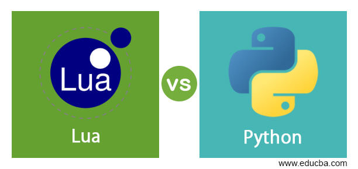

# Summary creation tool

<a href="https://github.com/akshat22/SE_HW2345/blob/main/LICENSE.md"></a>
[](https://github.com/akshat22/SE_HW2345/graphs/contributors)

[//]: # ([![License]&#40;https://img.shields.io/github/license/jayrajmulani/group2-se-homeworks&#41;]&#40;https://github.com/jayrajmulani/group2-se-homeworks/blob/main/LICENSE&#41;)

[//]: # ([![Python 3.8]&#40;https://img.shields.io/badge/python-3.8-blue.svg&#41;]&#40;https://www.python.org/downloads/release/python-3100/&#41;)

[//]: # (![Repo size]&#40;https://img.shields.io/github/repo-size/jayrajmulani/group2-se-homeworks&#41;)

[//]: # ([![Contributors]&#40;https://img.shields.io/github/contributors/jayrajmulani/group2-se-homeworks.svg&#41;]&#40;https://github.com/jayrajmulani/group2-se-hw1/graphs/contributors&#41; )



Python code for creating summaries of input CSV file by translating a lua code to python.

## Table of Contents

1. [LUA](#LUA)
2. [Goal](#Goal)
3. [Getting started](#Getting-started)
4. [File and function mapping](#file-and-function-mapping)
5. [License](#license)
6. [Contributors](#contributors)

## LUA

Lua is a lightweight, high-level, multi-paradigm programming language designed primarily for embedded use in applications. The features of the lua programming language include:

- simple 
- efficient
- portable
- Suitable for use as an embedded language within a host application

## Goal

The goal is to write some code to read a CSV file and generate summaries of columns (medians and standard deviation for numerics; mode and entropy for symbolic columns).

## Getting Started

### Pre-requisites

Ensure python is installed. You can check the version of python in the system using:

``` bash
python --version
```

Check if pip is installed. This can be done with the command:

``` bash
pip --version
```

The csv file can be accessed in the [Data folder](./data/data.csv)

### Installation

Clone this repository using

``` bash
git clone https://github.com/akshat22/SE_HW2345.git
```

You can download all the dependencies required to run the file using:

``` bash
pip install -r requirements.txt
```


## File and function mapping

The implementations for only `Sym` and `Num` classes are done so far in this repo.
The implementation of different util functions are also done like - `coerce`, `per`, `probability`

The scripts for test cases `sym`, `num` are also prepared [here](./test). 

The Lua classes and corresponding python implementation scripts are listed below:

| Class | Corresponding python script  |
|-------|------------------------------|
| Num   | [Num](./code/columns/Num.py) |
| Sym   | [Sym](./code/columns/Sym.py) |

## License

[//]: # (This project is licensed under [MIT]&#40;https://mit-license.org/&#41;.)

[//]: # (Further details regarding the license can be found [here]&#40;https://github.com/jayrajmulani/group2-se-homeworks/blob/main/LICENSE&#41;.)

## Contributors

- [Mohit Soni](https://github.com/mohitsoni2111)
- [Akshat Savla](https://github.com/akshat22)
- [Madiha](https://github.com/madiha2001)
- [Tilak Satra](https://github.com/tilaksatra)
- [Anagha patil]()
